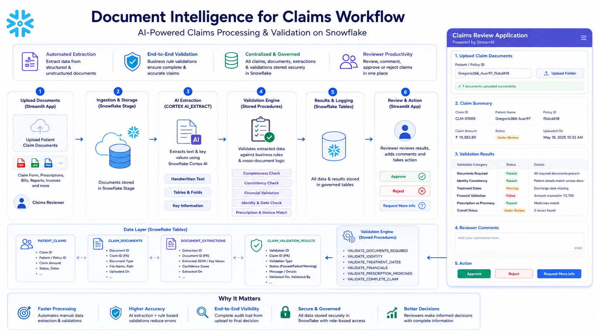

# Claims Document Intelligence using Snowflake Cortex AI

An end-to-end Snowflake Document Intelligence project that helps claims reviewers upload, process, validate, and review healthcare claim documents using Snowflake Cortex AI and Streamlit.

The solution allows claims reviewers to upload patient claim documents through a Streamlit application. Snowflake processes the uploaded documents, extracts key values using Cortex AI, stores patient claims, claim documents, document extractions, and validation results, and enables reviewers to view validation status, add comments, and approve or reject claims from the UI.



---
## Source Dataset

CSV dataset was downloaded using this link
https://synthetichealth.github.io/synthea/

Later converted the csv files to documents per patient using below github repo code.

Github Link: https://github.com/deept-agl/Generate_Patient_Claims_pdf_via_csvfiles

---

## Use Case

Healthcare claims teams often receive multiple documents for a single claim, such as claim forms, prescriptions, discharge summaries, hospital invoices, pharmacy invoices, diagnostic reports, and payment receipts.

Manual review can be slow and error-prone because reviewers need to check:

1. Are all required documents uploaded?
2. Is the patient identity consistent across documents?
3. Are admission and discharge dates valid?
4. Does the claimed amount match invoice and receipt details?
5. Do prescribed medicines match pharmacy bills?
6. Are there missing, mismatched, or suspicious values?
7. Should the claim be approved, rejected, or sent for more information?

This project automates document extraction and validation while keeping the final claim decision with the claims reviewer.

---

## Architecture

```text
Claims Reviewer
      │
      ▼
Streamlit Claims Review App
      │
      ▼
Upload Claim Documents
      │
      ▼
Snowflake Stage
      │
      ▼
Cortex AI Document Extraction
      │
      ▼
Extracted Claim Data
      │
      ▼
Claims Validation Stored Procedures
      │
      ▼
Validation Results
      │
      ▼
Reviewer UI
      │
      ├── View claim summary
      ├── View uploaded documents
      ├── View extraction details
      ├── View validation results
      ├── Add reviewer comments
      ├── Approve claim
      └── Reject claim
```

---

## Setup

### 1. Create Snowflake Infrastructure

Create the required Snowflake objects such as database, schema, warehouse, role, stage, and supporting objects.

```sql
00_setup/00_infra.sql
```

---

### 2. Test Document Extraction

Run the initial extraction test to validate that documents can be read and processed through Snowflake Cortex AI.

```sql
00_setup/01_test_extraction.sql
```

---

### 3. Create Prompt Templates

Create reusable prompt templates for structured document extraction.

```sql
00_setup/02_prompt_template.sql
```

---

### 4. Create Extraction Function

Create the extraction function that uses Cortex AI to extract values from uploaded documents.

```sql
00_setup/03_extraction_fn.sql
```

---

### 5. Create Extraction Tables

Create tables to store patient claims, claim documents, extracted document data, and validation results.

```sql
02_store_extracted_data/00_extraction_tables.sql
```

---

### 6. Load Extracted Data

Create the stored procedure to load extracted document values into Snowflake tables.

```sql
02_store_extracted_data/01_SP_load_extracted_data.sql
```

---

### 7. Create Claims Validation Procedures

Create validation stored procedures for claim-level business checks.

```sql
03_claims_validations/SP_validate_required_documents.sql
03_claims_validations/SP_validate_patient_identity_consistency.sql
03_claims_validations/SP_validate_treatment_dates_consistency.sql
03_claims_validations/SP_validate_financial_amt_recon.sql
03_claims_validations/SP_validate_prescription_vs_pharmacy_bill.sql
03_claims_validations/SP_Master_Validation.sql
```

---

### 8. Create Stream and Task Orchestration

Create stream and task objects to process newly uploaded claim folders automatically.

```sql
04_orchestration/00_stream_and_tasks.sql
```

---

### 9. Run the Claims Review App

Launch the Streamlit application for claims reviewers.

```text
CLAIMS_REVIEW_APP/
```

The app allows users to:

- Upload claim documents
- View patient claim details
- Review uploaded document status
- View extracted document information
- View validation results
- Add reviewer comments
- Approve claims
- Reject claims
- Request more information

---

## Validation Checks

The validation engine performs claim-level checks such as:

- Required document validation
- Patient identity consistency
- Treatment date consistency
- Financial amount reconciliation
- Prescription versus pharmacy invoice validation
- Overall claim validation summary

---

## Sample Validation Questions

This project helps answer questions such as:

```text
Are all required documents uploaded for this claim?

Does the patient name match across all documents?

Is the discharge date available and valid?

Does the claimed amount match the invoice and receipt amount?

Are prescribed medicines present in the pharmacy bill?

Should this claim be approved, rejected, or reviewed further?
```

---

## Data Stored in Snowflake

The solution stores structured claim intelligence in Snowflake tables, including:

- Patient claim details
- Uploaded claim document metadata
- Extracted document values
- Validation results
- Reviewer comments
- Claim decisions

---

## Reviewer Workflow

```text
1. Reviewer uploads claim documents from the Streamlit app.
2. Documents are stored in a Snowflake stage.
3. Cortex AI extracts key fields from each document.
4. Extracted values are stored in Snowflake tables.
5. Validation stored procedures run business checks.
6. Validation results are displayed in the app.
7. Reviewer checks issue details.
8. Reviewer adds comments.
9. Reviewer approves, rejects, or requests more information.
```

---

## Snowflake Features Used

- Snowflake stages
- Directory tables
- Snowflake Cortex AI extraction
- SQL stored procedures
- Streams and tasks
- Snowflake tables for extraction and validation logging
- Streamlit in Snowflake
- Role-Based Access Control

---

## Repository Structure

```text
Claims_Document_Intelligence_Snowflake/
│
├── 00_setup/
│   ├── .folder
│   ├── 00_infra.sql
│   ├── 01_test_extraction.sql
│   ├── 02_prompt_template.sql
│   └── 03_extraction_fn.sql
│
├── 02_store_extracted_data/
│   ├── .folder
│   ├── 00_extraction_tables.sql
│   └── 01_SP_load_extracted_data.sql
│
├── 03_claims_validations/
│   ├── .folder
│   ├── SP_Master_Validation.sql
│   ├── SP_validate_financial_amt_recon.sql
│   ├── SP_validate_patient_identity_consistency.sql
│   ├── SP_validate_prescription_vs_pharmacy_bill.sql
│   ├── SP_validate_required_documents.sql
│   └── SP_validate_treatment_dates_consistency.sql
│
├── 04_orchestration/
│   ├── .folder
│   └── 00_stream_and_tasks.sql
│
├── CLAIMS_REVIEW_APP/
│   ├── .streamlit/
│   ├── .folder
│   ├── pyproject.toml
│   ├── snowflake.yml
│   └── streamlit_app.py
│
└── README.md
```

---

## Streamlit App Capabilities

The claims review application provides a business-friendly interface for reviewers to:

- Upload claim document folders
- Track claim processing status
- View extracted claim information
- Review validation results by category
- Identify failed, warning, and passed checks
- Add review comments
- Approve claims
- Reject claims
- Access document-level details for investigation

---

## Example Claim Review Flow

```text
1. Upload documents for a patient claim.
2. Snowflake extracts structured values from claim form, invoices, prescription, and reports.
3. Validation procedures compare extracted values across documents.
4. App displays validation results such as Passed, Failed, or Warning.
5. Reviewer checks the issue details.
6. Reviewer adds comments.
7. Reviewer approves, rejects, or requests more information.
```

---

## Key Benefits

- Faster claims processing
- Reduced manual document review effort
- Improved validation accuracy
- Centralized claim and document intelligence
- Clear audit trail of extraction and validation results
- Business-friendly review experience through Streamlit
- Governed processing inside Snowflake

---

## Cleanup

Review and remove Snowflake objects manually when the project is no longer required.

Before cleanup, confirm that the database, schema, stage, tables, procedures, streams, tasks, and Streamlit app are no longer needed.
